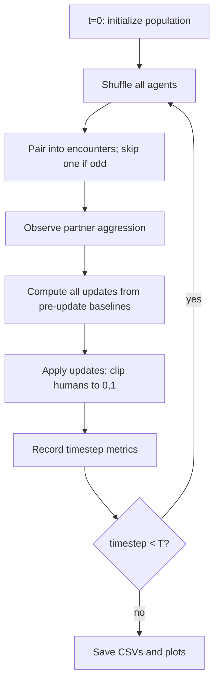

# Mixed-Autonomy Traffic ABM — Implementation Plan

## 1. Scientific model summary

**Research question:** Can aggressive AVs shift human driving norms, or does the effect depend on whether humans treat AV behavior as legitimate, irrelevant, or negative outgroup behavior?

**Mechanism:** Dynamic random-mixing topology — not a traffic simulator. At each timestep, agents shuffle, pair into temporary encounters, observe partner aggression, compute updates from **pre-update** values, apply all updates, then dissolve pairings.

**Hypotheses (tested via 9 conditions × 30 seeds):**

| Mechanism | Expected signal |
|-----------|----------------|
| Shared norm shift | Mean human baseline aggression rises over time, especially in **mostly_assimilation** at 25–50% AV prevalence |
| Rejection | Little or negative mean shift in **mostly_rejection** |
| Polarization | Variance rises in **mixed** environment |

**Key diagnostic:** Human-human encounter aggression after AV exposure — not just aggression during AV encounters.



---

## 2. File structure

All paths relative to [`git-cogs205b/abm-project/`](git-cogs205b/abm-project/).

```text
abm-project/
  PROMPT.md              # exists
  SKILL.md               # exists
  PLAN.md                # this plan (created on approval)
  README.md
  Dockerfile
  requirements.txt
  run_simulation.py
  src/
    __init__.py          # exports key public API
    agents.py            # agent types, init, clipping, response-type assignment
    model.py             # pairing, update rules, single-run simulation
    experiments.py       # parameter grid, hierarchical seeds, aggregation
    verification.py      # runtime checks (fail loudly)
    plotting.py          # matplotlib figures with Okabe-Ito palette
  tests/
    test_agents.py
    test_model.py
    test_verification.py
    test_experiments.py
  results/               # gitignored; created at runtime
    trajectories.csv
    encounter_metrics.csv
    summary_by_timestep.csv
    summary_final.csv
    plots/
      mean_aggression_over_time.png
      variance_over_time.png
      final_mean_by_condition.png
      final_variance_by_condition.png
      human_human_encounter_aggression.png
```

[`git-cogs205b/abm-project/.gitignore`](git-cogs205b/abm-project/.gitignore) already ignores `results/`, `__pycache__/`, `*.pyc` — no change needed.

---

## 3. Default parameters

| Parameter | Value |
|-----------|-------|
| `N_agents` | 200 |
| `timesteps` | 100 |
| `seeds` | 30 |
| `AV_aggression` | 0.90 |
| `human_influence_weight` | 1.00 |
| Initial human aggression | `Normal(0.35, 0.08)`, clipped to `[0, 1]` |
| Human susceptibility | `Uniform(0.02, 0.12)` |

**AV prevalence:** `0.00`, `0.25`, `0.50` → `n_av = int(N * prevalence)` (always integer for N=200).

**Environments (human response-type proportions):**

| Environment | Assimilator | Discounter | Rejecter |
|-------------|------------:|-----------:|---------:|
| `mostly_assimilation` | 70% | 20% | 10% |
| `mixed` | 45% | 10% | 45% |
| `mostly_rejection` | 10% | 20% | 70% |

**AV influence weights:** assimilator `+0.50`, discounter `0.00`, rejecter `-0.50`.

**Odd pairing rule (user-confirmed):** If agent count is odd, one randomly chosen agent is left unpaired and receives no update that timestep.

---

## 4. Data structures

### Agent objects ([`src/agents.py`](git-cogs205b/abm-project/src/agents.py))

```python
@dataclass
class HumanAgent:
    baseline_aggression: float
    susceptibility: float
    av_response_type: Literal["assimilator", "discounter", "rejecter"]

    @property
    def av_influence_weight(self) -> float: ...

@dataclass
class AVAgent:
    aggression: float  # fixed at 0.90
```

Use a tagged union or `is_av: bool` when storing mixed populations in a list.

### Trajectory record (per run, per timestep)

One row per `(seed, av_prevalence, environment, timestep)`:

| Column | Description |
|--------|-------------|
| `run_id` | Stable string ID for condition + seed |
| `seed` | Integer seed |
| `av_prevalence` | 0.0 / 0.25 / 0.5 |
| `environment` | `mostly_assimilation` / `mixed` / `mostly_rejection` |
| `timestep` | `0 … timesteps` |
| `n_humans`, `n_avs` | Population counts (constant) |
| `mean_human_aggression` | Mean human baseline aggression |
| `var_human_aggression` | Variance of human baseline aggression |
| `mean_aggression_assimilator` | By response type |
| `mean_aggression_discounter` | By response type |
| `mean_aggression_rejecter` | By response type |

### Encounter metrics (separate file — see Section 6)

Recorded in [`results/encounter_metrics.csv`](git-cogs205b/abm-project/results/encounter_metrics.csv), **not** merged into human baseline metrics.

---

## 5. Update rules

Implement in [`src/model.py`](git-cogs205b/abm-project/src/model.py). All human updates clip via `clip_aggression()` from [`src/agents.py`](git-cogs205b/abm-project/src/agents.py).

### Human observes human (simultaneous, pre-update values)

```text
new_i = old_i + susceptibility_i * human_influence_weight * (old_j - old_i)
new_j = old_j + susceptibility_j * human_influence_weight * (old_i - old_j)
```

Both `old_i` and `old_j` are read before either write. Each human appears in at most one pair per timestep, so cross-pair write conflicts cannot occur.

### Human observes AV (human only updates)

```text
new_baseline = old_baseline
             + susceptibility * av_influence_weight * (AV_aggression - old_baseline)
```

### AV rules

- AV aggression never changes.
- AV–AV pair: no update.
- AV never updates when paired with a human.

### Timestep execution order (critical)

For each timestep `t = 1 … timesteps`:

1. Snapshot all human `baseline_aggression` values (pre-update).
2. Shuffle agents; form pairs; randomly skip one if odd.
3. For each pair, compute tentative new values from snapshots only.
4. Apply all tentative updates; clip humans to `[0, 1]`.
5. Record state as timestep `t`.

Initial state (before step 1) is recorded as timestep `0`.

---

## 6. Timestep convention

**Strict rule — no exceptions:**

- `timestep = 0`: initial state, no updates applied yet.
- `timestep = 1`: after first update round.
- `timestep = timesteps`: after final update round.
- Total rows per run: **`timesteps + 1`** (101 when `timesteps = 100`).
- Timesteps are unique integers `0, 1, 2, …, timesteps` within each run.
- **Never** label both initial state and first update as `timestep = 0`.

Enforce via `verify_timesteps(trajectory_df, timesteps)` in [`src/verification.py`](git-cogs205b/abm-project/src/verification.py).

---

## 7. Separated encounter metrics

**Do not** average human and AV aggression into a single human-AV outcome metric.

During each timestep's pairing phase, accumulate per-encounter-type statistics **before** updates are applied (using pre-update aggression):

| Metric column | Definition |
|---------------|------------|
| `mean_human_hh_encounter_aggression` | Mean of both humans' pre-update baselines in human–human pairs |
| `mean_human_ha_encounter_aggression` | Mean of human pre-update baseline in human–AV pairs |
| `mean_av_ha_encounter_aggression` | Fixed AV aggression (`0.90`) in human–AV pairs — diagnostic only |
| `n_hh_encounters`, `n_ha_encounters` | Encounter counts for transparency |

Save to `encounter_metrics.csv` with the same `(run_id, seed, av_prevalence, environment, timestep)` keys as trajectories.

**Interpretation guardrail:** Only `mean_human_hh_encounter_aggression` and `mean_human_ha_encounter_aggression` describe human behavior. `mean_av_ha_encounter_aggression` is a constant diagnostic confirming AV pairs were logged correctly.

---

## 8. Module-by-module implementation

### [`src/agents.py`](git-cogs205b/abm-project/src/agents.py)

| Function / class | Responsibility |
|------------------|----------------|
| `clip_aggression(x)` | `min(1, max(0, x))` |
| `AV_INFLUENCE_WEIGHTS` | Dict mapping response type → weight |
| `assign_response_types(n, environment, rng)` | Multinomial assignment matching environment proportions |
| `create_humans(n, environment, rng)` | Draw aggression + susceptibility; assign types |
| `create_avs(n, aggression=0.90)` | Fixed-aggression AV list |
| `build_population(n_agents, av_prevalence, environment, rng)` | Split into humans + AVs; shuffle combined list |

### [`src/model.py`](git-cogs205b/abm-project/src/model.py)

| Function | Responsibility |
|----------|----------------|
| `pair_agents(agents, rng)` | Shuffle; chunk into pairs; return `(pairs, skipped_agent\|None)` |
| `compute_human_human_delta(h_i, h_j)` | Returns `(new_i, new_j)` from pre-update values |
| `compute_human_av_delta(human, av)` | Returns new human baseline only |
| `apply_encounter(pair)` | Dispatch by agent types; return updates dict `{agent_id: new_value}` |
| `record_timestep_metrics(humans, encounter_stats, meta)` | Build one trajectory + encounter row |
| `run_single_simulation(params, seed)` | Full run; return `(trajectory_df, encounter_df)` |

### [`src/experiments.py`](git-cogs205b/abm-project/src/experiments.py)

| Function | Responsibility |
|----------|----------------|
| `EXPERIMENT_GRID` | 3 prevalences × 3 environments = **9 conditions** |
| `condition_seed(base_seed, condition_idx, seed_idx)` | Hierarchical deterministic seed: e.g. `base_seed + condition_idx * 10_000 + seed_idx` |
| `run_all_conditions(params)` | 9 × 30 = **270 runs** |
| `aggregate_by_timestep(df)` | Mean ± std across seeds per condition per timestep |
| `aggregate_final(df)` | Final-timestep mean/var summaries per condition |

### [`src/verification.py`](git-cogs205b/abm-project/src/verification.py)

Each function returns `(passed: bool, message: str)`. `run_all_verifications(...)` collects failures and raises `VerificationError` listing all failures (fail loudly).

### [`src/plotting.py`](git-cogs205b/abm-project/src/plotting.py)

Apply SKILL.md `plt.rcParams` and Okabe-Ito `COLORS`. Environment colors: assimilation=blue, mixed=orange, rejection=green. Prevalence: 0%=black, 25%=blue, 50%=red/orange. Use line styles when overlaying many series.

### [`run_simulation.py`](git-cogs205b/abm-project/run_simulation.py)

1. Ensure `results/` and `results/plots/` exist.
2. Run full experiment grid with default parameters.
3. Run all runtime verification checks on a representative subset + full aggregated data.
4. Write CSVs.
5. Generate required plots.
6. Print summary path and verification status.

---

## 9. Runtime verification checks

Implement all eight checks from PROMPT.md / SKILL.md:

| # | Function | What it checks |
|---|----------|----------------|
| 1 | `verify_bounds(trajectory_or_agents)` | All human aggression in `[0, 1]` |
| 2 | `verify_population_constant(trajectory)` | `n_humans`, `n_avs` unchanged across timesteps |
| 3 | `verify_seed_determinism(run_fn, params, seed)` | Two runs with same seed → identical trajectory |
| 4 | `verify_null_condition(results)` | At 0% AV, changing environment produces negligible differential effect (or document that response type is inert without AV exposure) |
| 5 | `verify_av_fixed(encounter_df)` | `mean_av_ha_encounter_aggression == 0.90` always |
| 6 | `verify_response_types(model_fn)` | Micro-simulation: assimilator moves toward 0.90, discounter unchanged, rejecter moves away |
| 7 | `verify_multi_seed_aggregation(summary)` | Each condition has exactly 30 seeds |
| 8 | `verify_timesteps(trajectory, timesteps)` | Unique timesteps; exactly `timesteps + 1` rows; range `0…timesteps` |

`run_simulation.py` calls `run_all_verifications()` after simulation; **exit non-zero** on failure.

---

## 10. Pytest test files

Run from `abm-project/` with `pytest` (add `pytest.ini` or `pyproject.toml` with `pythonpath = .` so `src` imports resolve).

### [`tests/test_agents.py`](git-cogs205b/abm-project/tests/test_agents.py)

- `test_clip_aggression_below_zero` / `test_clip_aggression_above_one` / `test_clip_aggression_in_range`
- `test_response_type_counts_match_environment` (statistical or exact for fixed seed + large n)
- `test_av_influence_weights` (assimilator +0.5, discounter 0, rejecter -0.5)
- `test_av_fixed_aggression_initialization`

### [`tests/test_model.py`](git-cogs205b/abm-project/tests/test_model.py)

- `test_human_human_uses_pre_update_values` (construct pair with known values; verify simultaneous update math)
- `test_human_av_updates_human_only`
- `test_av_never_updates` (aggression constant after many timesteps)
- `test_timestep_indexing` (returns `0, 1, …, T`)
- `test_no_duplicate_timesteps`
- `test_trajectory_length_is_T_plus_1`
- `test_same_seed_identical_trajectory`

### [`tests/test_verification.py`](git-cogs205b/abm-project/tests/test_verification.py)

- `test_bounds_check_passes_valid`
- `test_bounds_check_fails_invalid` (inject out-of-range value)
- `test_response_type_micro_simulation_passes`
- `test_timestep_check_catches_duplicates`

### [`tests/test_experiments.py`](git-cogs205b/abm-project/tests/test_experiments.py)

- `test_grid_has_nine_conditions`
- `test_hierarchical_seeds_stable`
- `test_aggregation_has_thirty_seeds_per_condition`

Use small `N_agents`, `timesteps`, and `seeds` in tests for speed (e.g., N=20, T=5, seeds=3) via fixture overrides — distinct from production defaults.

---

## 11. requirements.txt

```
numpy
pandas
matplotlib
pytest
```

Pin only if reproducibility issues arise; start unpinned per course repo style. Every external import must appear here.

---

## 12. Dockerfile behavior

Create [`git-cogs205b/abm-project/Dockerfile`](git-cogs205b/abm-project/Dockerfile) (separate from workspace-root SSH Dockerfile):

```dockerfile
FROM python:3.12-slim
WORKDIR /app
COPY requirements.txt .
RUN pip install --no-cache-dir -r requirements.txt
COPY . .
CMD ["python", "run_simulation.py"]
```

**Behavior:**

- Installs **only** from `requirements.txt` (no cached/local venv assumptions).
- Default command runs the full simulation and writes to `results/`.
- Tests run separately: `docker run --rm <image> pytest` (override CMD) or `docker build` + `docker run … pytest` as documented in README.

---

## 13. Outputs (CSVs)

| File | Contents |
|------|----------|
| `results/trajectories.csv` | All 270 runs × 101 timesteps — per-run human baseline stats + by-type means |
| `results/encounter_metrics.csv` | Separated HH / HA-human / HA-AV encounter metrics per timestep |
| `results/summary_by_timestep.csv` | Aggregated mean ± std across 30 seeds per condition per timestep |
| `results/summary_final.csv` | Final-timestep mean/var and encounter summaries per condition |

Column naming uses snake_case, consistent keys for merging: `av_prevalence`, `environment`, `seed`, `timestep`.

---

## 14. Plots (saved to `results/plots/`)

**Required (5):**

1. **Mean human baseline aggression over time** — lines per condition (env × prevalence), shaded ±1 SD across seeds.
2. **Variance in human baseline aggression over time** — same grouping; highlights polarization in `mixed`.
3. **Final mean aggression by condition** — bar or point plot across 9 conditions.
4. **Final variance by condition** — polarization comparison.
5. **Human-human encounter aggression over time** — key norm-shift diagnostic.

**Optional (if space permits):**

- Mean aggression by response type over time (faceted by environment).
- Human-AV human aggression over time.
- Histogram of final baseline aggression for selected conditions.

---

## 15. README structure

[`git-cogs205b/abm-project/README.md`](git-cogs205b/abm-project/README.md) sections:

1. **Overview** — research question and one-paragraph model summary.
2. **Model specification**
   - Agent types and parameters (table)
   - Update rules (human–human, human–AV)
   - Timestep convention
   - Experimental grid (3×3)
   - Encounter metric definitions (emphasize separation)
3. **How to run**
   - `pip install -r requirements.txt`
   - `python run_simulation.py`
   - `pytest`
   - Docker build/run commands
4. **Results** — brief interpretation of saved outputs referencing plot filenames; note which conditions support norm shift / rejection / polarization.
5. **Verification** — list runtime checks and what failure means.
6. **Reflection on accuracy and trust**
   - Model limitations (no spatial structure, toy mixing topology)
   - Determinism and seed sensitivity
   - What the agent (LLM) implemented vs. what was manually verified
   - Honest assessment of confidence in results

---

## 16. Risks and resolved ambiguities

| Item | Resolution |
|------|------------|
| Odd agent pairing | One random agent skipped per timestep (user confirmed) |
| Simultaneous HH updates | Snapshot pre-update values; apply all pair deltas after full pass |
| 0% AV null check | Environment differences should not matter; verify trajectories are statistically similar across environments at 0% AV |
| Large CSV size | 270 × 101 ≈ 27k trajectory rows — acceptable; no per-agent time series needed |
| Import path | Use `src` package with `PYTHONPATH=.` or `pip install -e .` omitted; prefer `pythonpath` in pytest config for simplicity |

---

## 17. Implementation order

1. `src/agents.py` + `tests/test_agents.py`
2. `src/model.py` + `tests/test_model.py`
3. `src/verification.py` + `tests/test_verification.py`
4. `src/experiments.py` + `tests/test_experiments.py`
5. `src/plotting.py`
6. `run_simulation.py`, `requirements.txt`, `Dockerfile`
7. Run `pytest` then `python run_simulation.py`
8. Write `README.md` and save approved plan as `PLAN.md`
