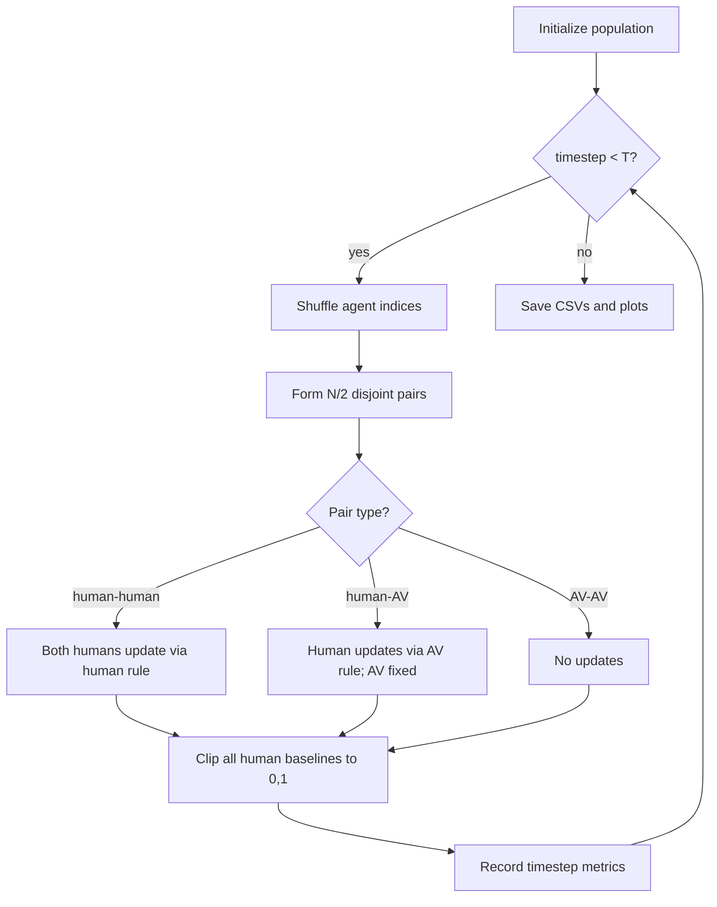

# Mixed-Autonomy Traffic ABM — Implementation Plan

This plan implements the toy agent-based model specified in [prompt.md](git-cogs205b/abm-project/prompt.md) and [skill.md](git-cogs205b/abm-project/skill.md). It is intended to be saved as `PLAN.md` and executed without further design decisions.

## 1. Scientific model summary

**Research question:** Can aggressive autonomous vehicles shift human driving norms, or does their effect depend on whether humans treat AV behavior as legitimate, irrelevant, or negative outgroup behavior?

**Mechanism:** At each timestep, all 200 agents are shuffled and paired sequentially (100 pairs). Pairings dissolve after the timestep. Humans update `baseline_aggression` based on what they observe; AVs are fixed at `0.90` and never learn.

**Three human AV-response types:**

| Type | `av_influence_weight` | Behavior after AV encounter |
|------|----------------------:|----------------------------|
| assimilator | +0.50 | Move toward AV aggression |
| discounter | 0.00 | No update from AV |
| rejecter | -0.50 | Move away from AV aggression |

**Hypothesized population patterns:**

- **Mostly assimilation (70/20/10):** mean aggression rises with AV prevalence
- **Mostly rejection (10/20/70):** mean aggression flat or falls with AV prevalence
- **Mixed (45/10/45):** variance rises (polarization) with AV prevalence

**Design decisions (resolved):**

- Human-human pairs: **both agents update simultaneously** from pre-update baselines (avoids order bias)
- Pairing: **shuffle all agents, pair sequentially** (one encounter per agent per timestep; with `N=200`, no leftover agent)
- Updates are **synchronous within a timestep**: compute all `new_baseline` values, then apply



---

## 2. File structure

```text
abm-project/
  PROMPT.md              # rename/copy from prompt.md (canonical casing)
  PLAN.md                # this plan
  SKILL.md               # rename/copy from skill.md
  README.md
  Dockerfile
  requirements.txt
  run_simulation.py
  src/
    __init__.py
    agents.py
    model.py
    experiments.py
    verification.py
    plotting.py
  results/               # gitignored outputs (CSVs + PNGs)
    trajectories/
    summaries/
    plots/
```

**Dependencies** (`requirements.txt`): `numpy`, `pandas`, `matplotlib` (pin minor versions for Docker reproducibility).

---

## 3. Data structures

### Enums / constants (`src/agents.py`)

```python
class AvResponseType(Enum):
    ASSIMILATOR = "assimilator"
    DISCOUNTER = "discounter"
    REJECTER = "rejecter"

AV_INFLUENCE_WEIGHTS = {
    AvResponseType.ASSIMILATOR: 0.50,
    AvResponseType.DISCOUNTER: 0.00,
    AvResponseType.REJECTER: -0.50,
}

ENVIRONMENTS = {
    "mostly_assimilation": {"assimilator": 0.70, "discounter": 0.20, "rejecter": 0.10},
    "mixed":               {"assimilator": 0.45, "discounter": 0.10, "rejecter": 0.45},
    "mostly_rejection":    {"assimilator": 0.10, "discounter": 0.20, "rejecter": 0.70},
}

AV_PREVALENCE_LEVELS = [0.00, 0.25, 0.50]
```

### Dataclasses

**`HumanAgent`**
- `agent_id: int`
- `baseline_aggression: float` — observed and updated state
- `susceptibility: float`
- `av_response_type: AvResponseType`
- `av_influence_weight: float` — set at init from type map

**`AVAgent`**
- `agent_id: int`
- `aggression: float` — fixed, default `0.90`

### Runtime collections (`src/model.py`)

- `agents: list[HumanAgent | AVAgent]`
- `humans: list[HumanAgent]` — cached view
- `avs: list[AVAgent]` — cached view
- `rng: np.random.Generator` — seeded `numpy` generator

### Metrics record (per run, per timestep)

```python
@dataclass
class TimestepMetrics:
    timestep: int
    mean_human_aggression: float
    var_human_aggression: float
    mean_by_type: dict[str, float]          # assimilator / discounter / rejecter
    mean_hh_encounter_aggression: float   # mean observed aggression in HH pairs
    mean_ha_encounter_aggression: float   # mean observed aggression in HA pairs
    n_hh_encounters: int
    n_ha_encounters: int
```

---

## 4. File-by-file implementation plan

### [`src/agents.py`](git-cogs205b/abm-project/src/agents.py)

| Function / class | Responsibility |
|------------------|----------------|
| `AvResponseType` | Enum for response types |
| `AV_INFLUENCE_WEIGHTS`, `ENVIRONMENTS` | Canonical parameter tables |
| `HumanAgent` | Dataclass + `observed_aggression()` returning `baseline_aggression` |
| `AVAgent` | Dataclass + `observed_aggression()` returning fixed `aggression` |
| `clip_aggression(x) -> float` | `min(1.0, max(0.0, x))` |
| `assign_response_types(n_humans, proportions, rng) -> list[AvResponseType]` | Largest-remainder method for exact counts summing to `n_humans`, then shuffle assignment |
| `create_human_population(n, rng, environment) -> list[HumanAgent]` | Draw `baseline_aggression ~ Normal(0.35, 0.08)` clipped; `susceptibility ~ Uniform(0.02, 0.12)`; assign response types |
| `create_av_population(n, aggression=0.90) -> list[AVAgent]` | Fixed-aggression AVs |

### [`src/model.py`](git-cogs205b/abm-project/src/model.py)

| Function / class | Responsibility |
|------------------|----------------|
| `SimulationConfig` | Dataclass holding all run parameters (`n_agents`, `timesteps`, `av_prevalence`, `environment`, `seed`, weights, `av_aggression`) |
| `MixedAutonomyModel` | Core simulation engine |
| `MixedAutonomyModel.__init__(config)` | Build population: `n_av = round(n_agents * av_prevalence)`, `n_human = n_agents - n_av` |
| `MixedAutonomyModel._pair_agents() -> list[tuple]` | Shuffle indices, return list of `(agent_a, agent_b)` pairs |
| `MixedAutonomyModel._update_human_from_human(human, observed_aggression)` | Human-human update rule |
| `MixedAutonomyModel._update_human_from_av(human, av_aggression)` | Human-AV update rule |
| `MixedAutonomyModel._compute_updates(pairs) -> dict[int, float]` | For each pair, compute new baselines for all updating humans using **old** baselines; return `{agent_id: new_baseline}` |
| `MixedAutonomyModel._apply_updates(updates)` | Write new baselines and clip |
| `MixedAutonomyModel.step() -> TimestepMetrics` | One full timestep: pair, update, record |
| `MixedAutonomyModel.run() -> list[TimestepMetrics]` | Run `timesteps` steps; return trajectory |
| `MixedAutonomyModel.get_final_stats() -> dict` | Final mean, variance, means by type |

**Update logic (explicit):**

```text
# Human observes human (both ends of pair):
difference = observed_aggression - old_baseline
new_baseline = old_baseline + susceptibility * 1.00 * difference

# Human observes AV (human end only):
difference = AV_aggression - old_baseline
new_baseline = old_baseline + susceptibility * av_influence_weight * difference

# Always:
new_baseline = clip(new_baseline, 0, 1)
```

**Encounter aggression metrics:**

- **HH encounter:** for each human-human pair, record both agents' `baseline_aggression` (pre-update); timestep mean = mean of all recorded values
- **HA encounter:** record AV `aggression` and human `baseline_aggression` (pre-update); timestep mean = mean of all recorded values
- **AV-AV pairs:** no updates, no encounter-metric contribution (rare; only when `av_prevalence >= 0.50`)

### [`src/experiments.py`](git-cogs205b/abm-project/src/experiments.py)

| Function / class | Responsibility |
|------------------|----------------|
| `ExperimentGrid` | Holds full factorial: 3 prevalences × 3 environments × 30 seeds = **270 runs** |
| `run_single_simulation(config) -> tuple[pd.DataFrame, dict]` | Returns per-timestep trajectory DF + run metadata/final summary |
| `run_full_grid(base_config) -> None` | Iterate all conditions; write CSVs |
| `aggregate_across_seeds() -> pd.DataFrame` | Group by `(environment, av_prevalence)`; compute mean ± std of final outcomes and time-series |

**Seed scheme (deterministic, hierarchical):**

```python
run_seed = base_seed + hash_offset(environment, av_prevalence, seed_index)
```

Use a fixed integer formula (e.g., `base_seed + env_id * 1000 + prev_id * 100 + seed_index`) — no Python `hash()` (not stable across sessions).

### [`src/verification.py`](git-cogs205b/abm-project/src/verification.py)

| Function | Check |
|----------|-------|
| `check_bounds(model)` | All human `baseline_aggression` in `[0, 1]` after every step |
| `check_population_constant(model, initial_counts)` | `n_humans`, `n_avs` unchanged |
| `check_seed_determinism(config)` | Two runs with same config produce identical final mean |
| `check_null_condition(config_0pct_av)` | Trajectories at 0% AV nearly identical across environments (tolerance on final mean, e.g. `< 0.005`) |
| `check_av_fixed(model)` | AV `aggression` unchanged from init through all steps |
| `check_response_types_after_av_encounter()` | Isolated micro-simulation: one assimilator, one discounter, one rejecter each paired once with AV; assert direction of change |
| `check_sensitivity_multi_seed(summary_df)` | Each condition has exactly 30 seed rows |
| `run_all_checks(config) -> list[CheckResult]` | Orchestrator; raises or logs failures |

**Response-type micro-test detail:**

- Create 3 humans with identical `baseline_aggression=0.35`, `susceptibility=0.10`, one per response type
- Pair each with one AV (`aggression=0.90`) for a single timestep
- Assert: assimilator baseline **increases**, discounter **unchanged**, rejecter **decreases**

### [`src/plotting.py`](git-cogs205b/abm-project/src/plotting.py)

| Function | Output |
|----------|--------|
| `setup_plot_style()` | Apply SKILL.md `rcParams` and `COLORS` dict |
| `plot_mean_aggression_over_time(agg_df, outpath)` | Line plot: x=timestep, y=mean aggression; lines = AV prevalence; facets or line styles = environment |
| `plot_variance_over_time(agg_df, outpath)` | Same layout for variance |
| `plot_final_mean_by_condition(summary_df, outpath)` | Grouped bar chart: environment × AV prevalence |
| `plot_final_variance_by_condition(summary_df, outpath)` | Grouped bar chart for polarization |
| `plot_mean_by_response_type(agg_df, outpath)` | Optional: lines per response type in mixed environment |
| `generate_all_plots(results_dir)` | Called by entrypoint after grid completes |

**Style rules (from SKILL.md):**

- Okabe-Ito palette; environment colors: assimilation=blue, mixed=orange, rejection=green
- AV prevalence: 0%=black/gray, 25%=blue, 50%=red/orange
- Combine color + line style (solid/dashed/dotted for environments)
- Save PNG at 300 dpi to `results/plots/`

### [`run_simulation.py`](git-cogs205b/abm-project/run_simulation.py)

Entry point:

1. Parse optional CLI overrides (`--seeds`, `--timesteps`, `--output-dir`) with defaults from spec
2. Create `results/` subdirectories
3. Run `run_all_checks()` on a small smoke config **before** full grid
4. Run full `ExperimentGrid`
5. Aggregate seeds
6. Call `generate_all_plots()`
7. Print summary table and verification status to stdout

### [`Dockerfile`](git-cogs205b/abm-project/Dockerfile)

```dockerfile
FROM python:3.11-slim
WORKDIR /app
COPY requirements.txt .
RUN pip install --no-cache-dir -r requirements.txt
COPY . .
CMD ["python", "run_simulation.py"]
```

### [`README.md`](git-cogs205b/abm-project/README.md)

See Section 10 below.

---

## 5. Parameter grid

| Parameter | Values | Notes |
|-----------|--------|-------|
| `N_agents` | 200 | Fixed |
| `timesteps` | 100 | Fixed |
| `seeds` | 30 | Indices `0..29` |
| `AV_aggression` | 0.90 | Fixed |
| `human_influence_weight` | 1.00 | Fixed |
| `AV prevalence` | 0.00, 0.25, 0.50 | → 0, 50, 100 AVs |
| `Environment` | mostly_assimilation, mixed, mostly_rejection | See proportion table |
| Initial human aggression | `Normal(0.35, 0.08)` clipped | Per human, per seed |
| Susceptibility | `Uniform(0.02, 0.12)` | Per human, per seed |

**Full factorial:** 3 × 3 × 30 = **270 simulation runs**

**Population counts per prevalence:**

| AV prevalence | AVs | Humans |
|--------------|-----|--------|
| 0.00 | 0 | 200 |
| 0.25 | 50 | 150 |
| 0.50 | 100 | 100 |

---

## 6. Outputs (CSV schema)

### Per-run trajectory: `results/trajectories/{env}_{prev}_{seed}.csv`

| Column | Description |
|--------|-------------|
| `seed`, `environment`, `av_prevalence`, `timestep` | Run identifiers |
| `mean_human_aggression` | Population mean at timestep |
| `var_human_aggression` | Population variance at timestep |
| `mean_assimilator`, `mean_discounter`, `mean_rejecter` | Means by response type |
| `mean_hh_encounter_aggression` | Mean observed aggression in HH pairs |
| `mean_ha_encounter_aggression` | Mean observed aggression in HA pairs |
| `n_hh_encounters`, `n_ha_encounters` | Encounter counts |

### Per-run summary: `results/summaries/run_summary.csv` (one row per run)

| Column | Description |
|--------|-------------|
| `seed`, `environment`, `av_prevalence` | Identifiers |
| `final_mean_aggression`, `final_var_aggression` | Timestep 100 values |
| `final_mean_assimilator`, `..._discounter`, `..._rejecter` | Final type means |
| `initial_mean_aggression` | Timestep 0 (sanity) |

### Aggregated: `results/summaries/aggregated_summary.csv`

| Column | Description |
|--------|-------------|
| `environment`, `av_prevalence` | Group keys |
| `mean_final_aggression`, `std_final_aggression` | Across 30 seeds |
| `mean_final_variance`, `std_final_variance` | Across 30 seeds |
| `n_seeds` | Should be 30 |

### Aggregated time-series: `results/summaries/aggregated_trajectories.csv`

- Mean and std of `mean_human_aggression` and `var_human_aggression` at each timestep, grouped by condition

---

## 7. Verification checks (implementation checklist)

| # | Check | When | Pass criterion |
|---|-------|------|----------------|
| 1 | Bounds | After every `step()` | `0 <= baseline <= 1` for all humans |
| 2 | Population constant | After every `step()` | Human/AV counts match initialization |
| 3 | Seed determinism | Pre-grid unit test | Identical `final_mean` bit-for-bit or within `1e-12` |
| 4 | Null (0% AV) | Post-grid analysis | Final means across 3 environments differ by `< 0.005` (AV type assignment irrelevant) |
| 5 | AV fixed | After full run | `av.aggression == 0.90` always |
| 6 | Response types | Isolated micro-sim | Assimilator up, discounter flat, rejecter down after one AV encounter |
| 7 | Multi-seed | Aggregated output | `n_seeds == 30` for all 9 conditions |

`run_simulation.py` should **exit non-zero** if checks 1–3, 5, 6, or 7 fail.

---

## 8. Plotting plan

**Required figures** (save to `results/plots/`):

1. `mean_aggression_over_time.png` — 3 panels (one per environment) or single plot with 9 lines; x=timestep (0–100), y=mean human baseline aggression; error bands = ±1 std across seeds
2. `variance_over_time.png` — same layout for variance (polarization diagnostic)
3. `final_mean_by_condition.png` — grouped bars: x=AV prevalence, groups=environment, y=final mean aggression (seed-aggregated)
4. `final_variance_by_condition.png` — grouped bars for final variance

**Optional (if time permits):**

5. `hh_encounter_aggression_over_time.png` — tests whether norm shift appears in later human-human encounters (key diagnostic from PROMPT.md)
6. `final_aggression_distribution.png` — histograms of human baselines at t=100 for mixed environment across prevalences

---

## 9. README structure

```markdown
# Mixed-Autonomy Traffic ABM

## Overview
- Research question and main hypothesis (2–3 sentences)

## Model specification
- Agent types and attributes
- Initial value distributions
- Update rules (human-human, human-AV, AV no-update)
- Pairing topology (shuffle + sequential pairs)
- Experimental conditions table (3×3 grid)
- Default parameters

## How to run
- Local: `pip install -r requirements.txt && python run_simulation.py`
- Docker: `docker build -t abm . && docker run -v $(pwd)/results:/app/results abm`

## Results
- Brief summary of aggregated findings (mean shift, rejection, polarization)
- Embed or link to the 4 required plots
- Reference key CSV files

## Verification
- List of checks run and expected pass behavior
- Note any tolerances used (null condition)

## Reflection on accuracy and trust
- When to trust results (all checks pass, pattern across seeds)
- When to distrust (from PROMPT.md/SKILL.md failure modes)
- Limitations: toy model, no spatial structure, simultaneous update assumption

## Project layout
- File tree with one-line descriptions
```

---

## 10. Dockerfile / environment plan

- **Base image:** `python:3.11-slim`
- **requirements.txt:** `numpy>=1.26,<2`, `pandas>=2.0`, `matplotlib>=3.8`
- **No GPU, no Jupyter** — CLI-only reproducible batch run
- **Volume mount:** document mounting `results/` for persisting outputs outside container
- Add `results/` to [`.gitignore`](git-cogs205b/.gitignore) (or local `abm-project/.gitignore`)

---

## 11. Risks and ambiguities (resolved or flagged)

| Item | Resolution |
|------|------------|
| Human-human update direction | **Both update simultaneously** (user confirmed) |
| Pairing algorithm | **Shuffle + sequential pairs** (user confirmed) |
| AV-AV pairs at 50% prevalence | Possible (~25 pairs when 100 AVs); no updates; exclude from encounter metrics or record separately with `n_aa_encounters` |
| Response-type count rounding | Use **largest-remainder** so counts sum exactly to `n_humans` |
| 0% AV null check | Expect environments to converge; small differences only from different response-type labels (no AV exposure) — assert final means within tight tolerance |
| Order effects within timestep | **Synchronous update** from pre-step baselines |
| Filename casing | Normalize to `PROMPT.md`, `SKILL.md` per project spec |
| Scientific interpretation | README must distinguish mean shift vs variance (polarization); do not over-claim from single seed |

---

## 12. Implementation order

1. `agents.py` — types, factories, clip helper
2. `model.py` — single-run engine + metrics
3. `verification.py` — micro-tests and orchestrator
4. `experiments.py` — grid runner + CSV writers
5. `plotting.py` — figures from aggregated CSVs
6. `run_simulation.py` — wire together
7. `requirements.txt`, `Dockerfile`, `README.md`
8. Rename `prompt.md`/`skill.md` → canonical casing; save this document as `PLAN.md`
9. Smoke run (1 seed, all conditions) → full 30-seed run → verify outputs
